<!-----

You have some errors, warnings, or alerts. If you are using reckless mode, turn it off to see inline alerts.
* ERRORs: 0
* WARNINGs: 0
* ALERTS: 15

Conversion time: 2.395 seconds.

Using this Markdown file:

1. Paste this output into your source file.
2. See the notes and action items below regarding this conversion run.
3. Check the rendered output (headings, lists, code blocks, tables) for proper
   formatting and use a linkchecker before you publish this page.

Conversion notes:

* Docs to Markdown version 1.0β35
* Thu Dec 21 2023 02:32:24 GMT-0800 (PST)
* Source doc: User Interface (Prototype)
* This document has images: check for >>>>>  gd2md-html alert:  inline image link in generated source and store images to your server. NOTE: Images in exported zip file from Google Docs may not appear in  the same order as they do in your doc. Please check the images!

WARNING:
You have 6 H1 headings. You may want to use the "H1 -> H2" option to demote all headings by one level.

----->

# User Interface Prototype

# Main Flow - Experience Post

Upon the initial visit to the page, unregistered visitors will be presented with this screen. The content on this page revolves around posts sharing experiences related to botanical works, gardening techniques, and captivating images of beautiful plants. Registered users have the privilege to upload posts and engage with Upvotes, Downvotes, and comments on this platform.

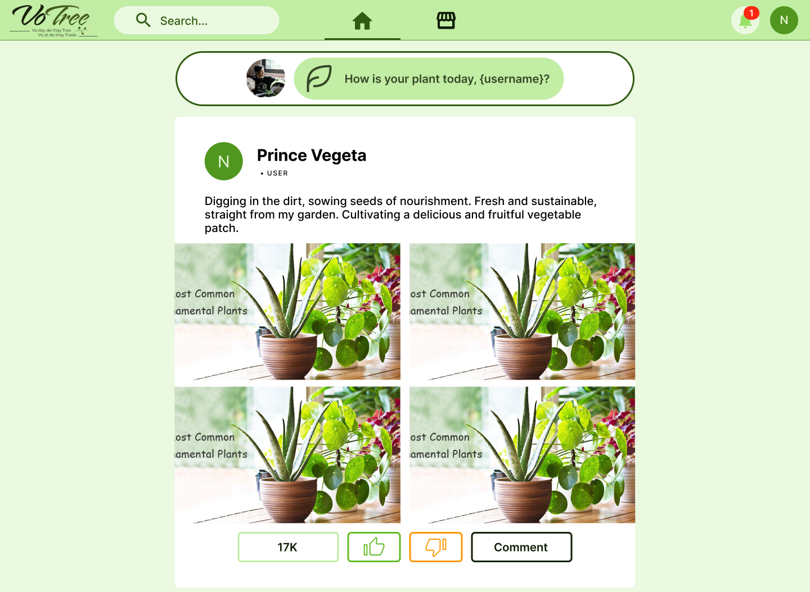

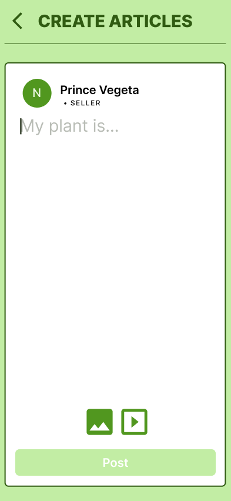

## The main screen for unregistered users (Desktop and Mobile)

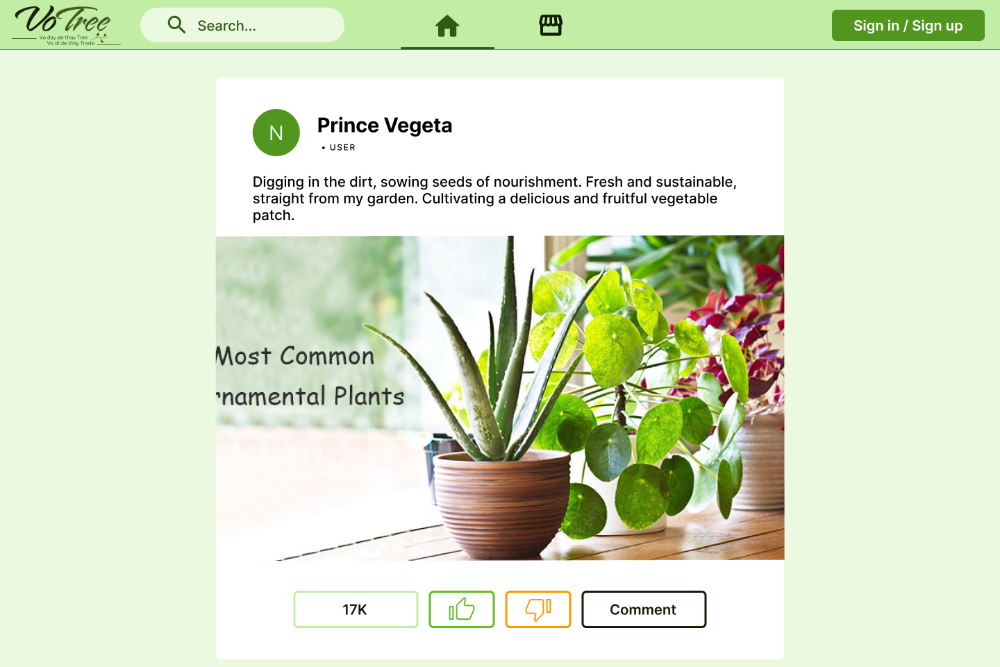

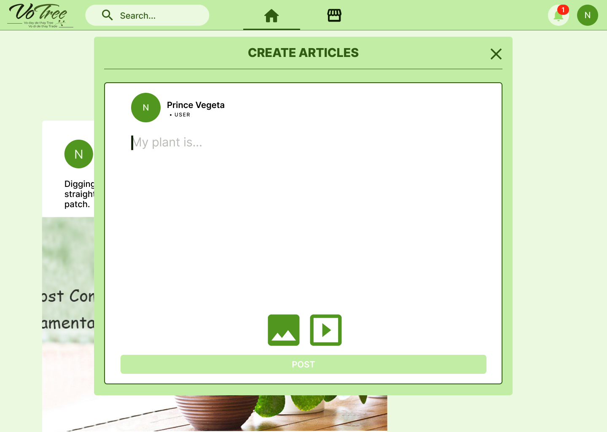

## The main screen after login (Desktop and Mobile)

# Create Article

After logging in, the "Create Article" bar will appear at the top of the Main screen. When the user clicks on it, a pop-up form for creating an article will be displayed.

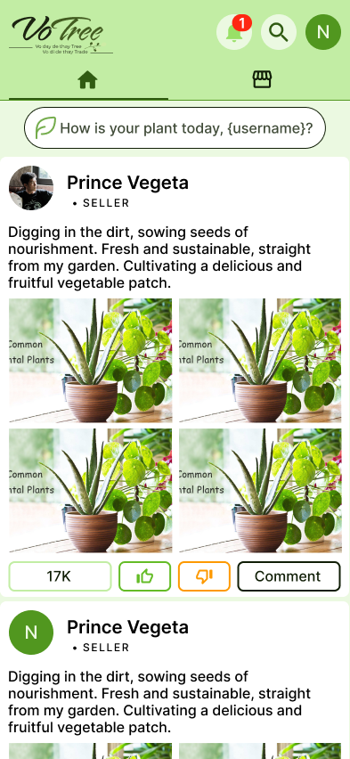

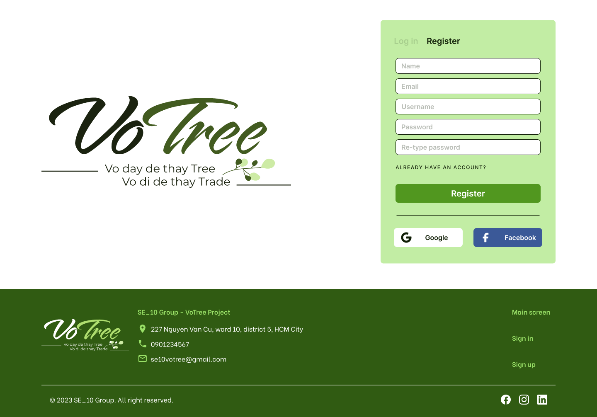

# Login / Register Screen

At not-login state, Guest who wants to register; User / Seller who wants to login to use our services, can click on the Sign in/ Sign up button to redirect to Login / Register screen as shown below:

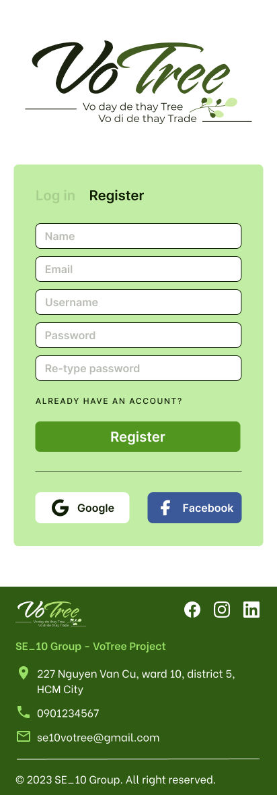

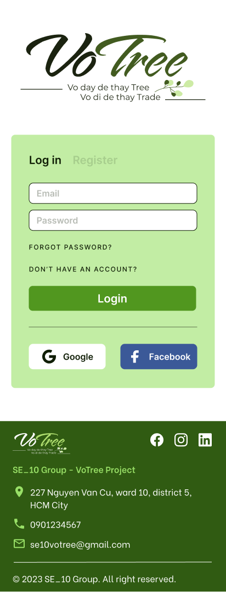

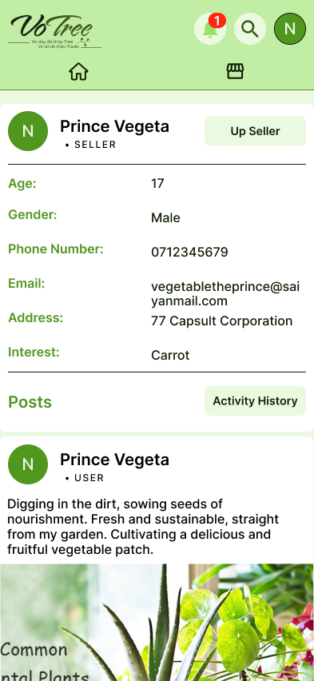

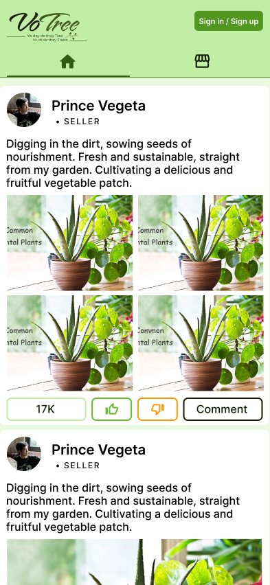

## Login and Register Pages (Desktop and Mobile)

# User / Seller Profile Screen

Registered users can access this page by clicking on their avatar located in the right corner of the screen. On this page, users can view and manage their personal information, choose to upgrade their account to a Seller, and review their Activity History.

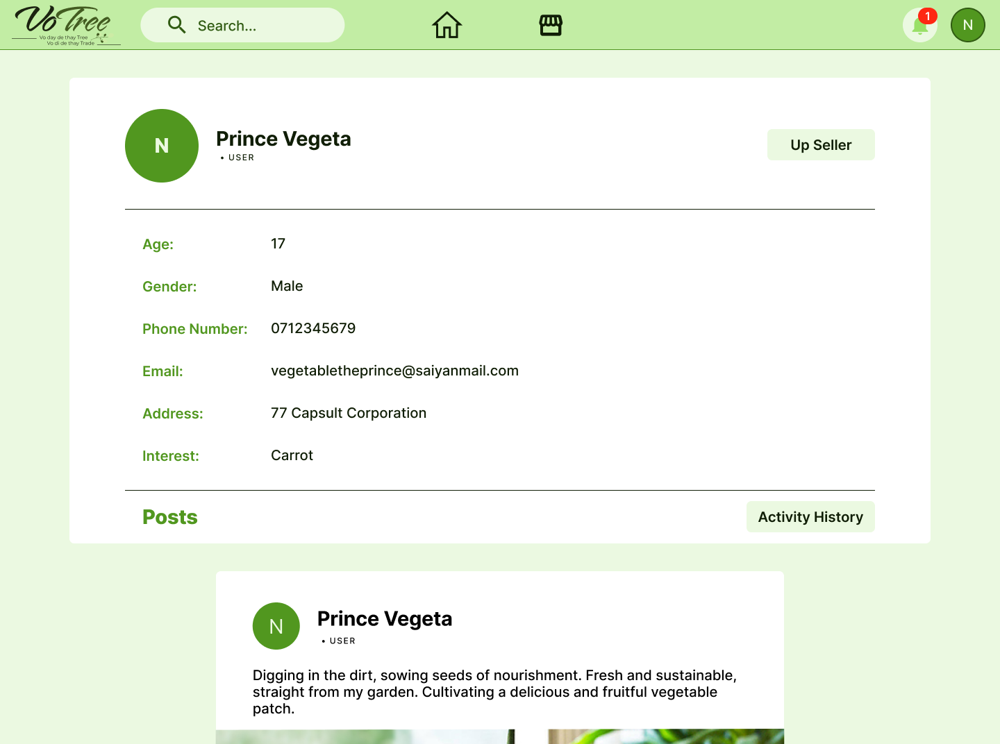

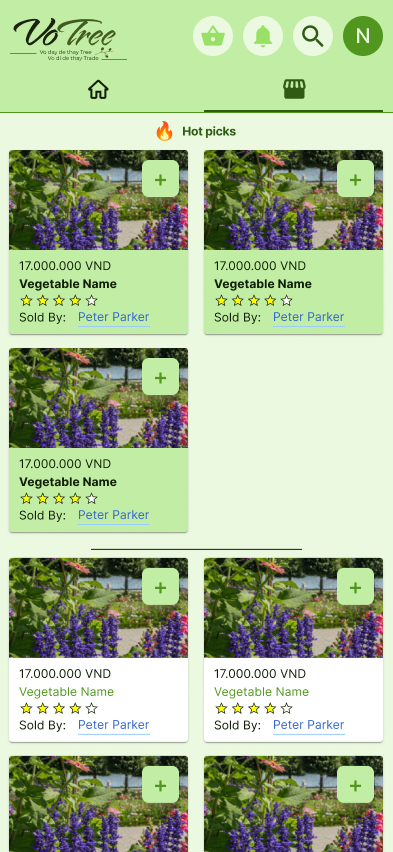

## User Profile Screen (Desktop and Mobile)

# Upgrade to Seller form

Upon clicking the "Up Seller" button, the following form will appear, prompting the user to provide essential information necessary to apply for a Seller account.

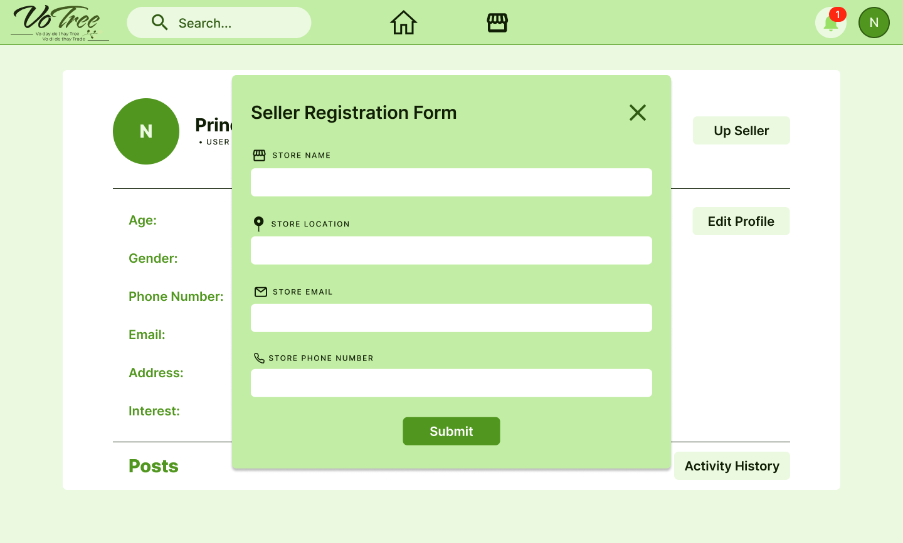

# Marketplace Screen

Our system also serves a crucial purpose by enabling users to explore and shop for plants and botanical products. Positioned on the right side of the Main Screen button in the navigation bar, the Marketplace option is represented by a grocery store icon.

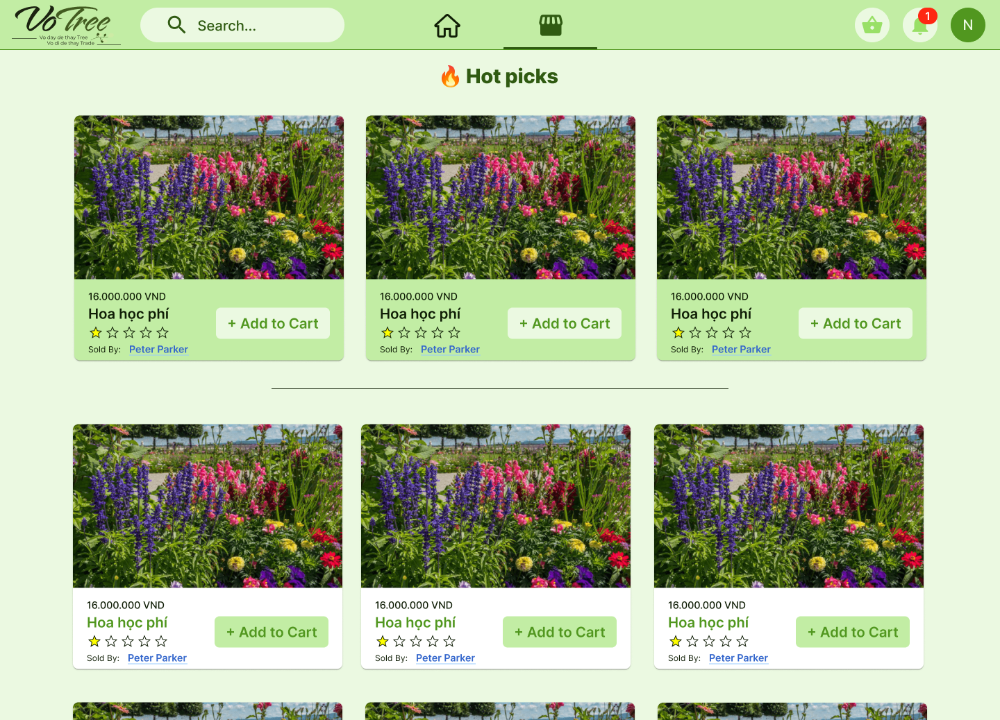

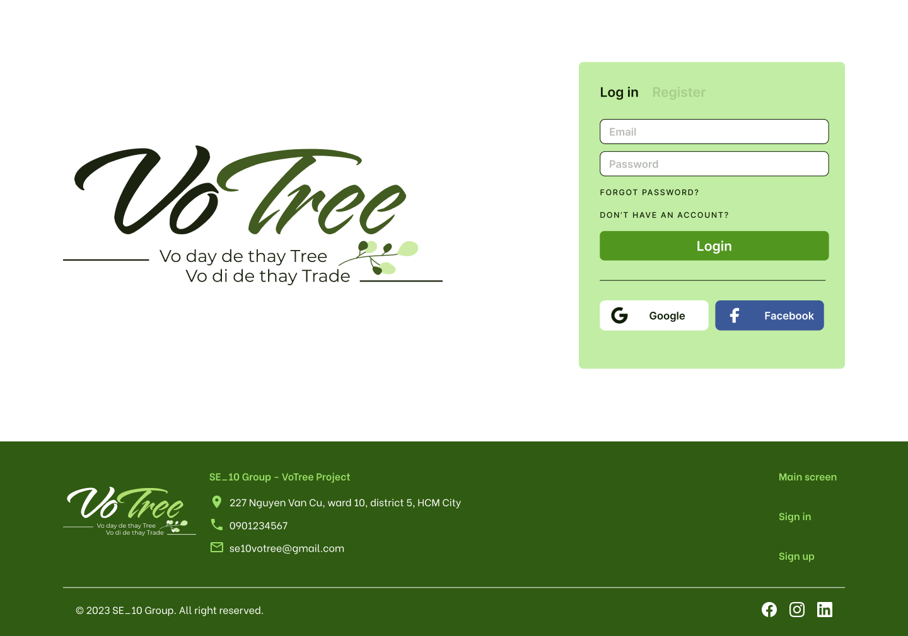

## Marketplace main screen (Desktop and Mobile)